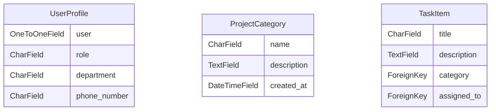

# 🚀 SmartTaskEngine

> **Level 1 Progressive Python & Django Application**  
> **Category:** Project Management  
> **Built by:** Autonomous AI Django Project Factory

---

## 📋 1. Project Overview

Clean Django task management application featuring task status tracking, categories, priority levels, and dashboard analytics.

This application is designed following high-quality, production-style Django backend architecture. It features modular separation of concerns, normalized ORM models, clean REST API endpoints, security middleware, and responsive frontend UI views.

---

## ✨ 2. Key Features

- **Modular**: Django Apps Architecture
- **Normalized**: Database Models & ORM Constraints
- **Custom**: User Authentication & Admin Panel
- **Comprehensive**: Input Validation & Security Filters

---

## 🛠️ 3. Tech Stack

- **Backend:** Python 3.14+, Django 5.x+, Django REST Framework (DRF)
- **Database:** SQLite (Development) / PostgreSQL (Production Compatible)
- **Authentication:** Custom User Model / Session & JWT Token Auth
- **Frontend:** Responsive HTML5/CSS3 with Bootstrap & Glassmorphism design
- **Testing:** Django TestCase & APITestCase Suite
- **Code Quality & Security:** Ruff Linting, Environment Secrets Isolation, CORS/CSRF Security Middleware

---

## 🏗️ 4. System Architecture

The application adopts a modular Django project architecture:

```text
smarttaskengine/
├── config/                  # Core settings, WSGI, ASGI, and root URL router
├── tasks/                   # Business domain app
│   ├── models.py            # Normalized database models & relationships
│   ├── serializers.py       # DRF JSON serializers & validation logic
│   ├── views.py             # ViewSets and API controllers
│   ├── permissions.py       # Custom Role-Based Access Control (RBAC)
│   ├── admin.py             # Admin panel customizations
│   ├── tests.py             # Automated unit and API test suite
│   └── urls.py              # App-level URL routes
├── templates/               # Responsive HTML templates
├── manage.py                # Django CLI entrypoint
├── requirements.txt         # Project dependencies
└── .env.example             # Environment configuration template
```

---

## 🗄️ 5. Database & Entity Relationship Model

### Models Overview


---

## 📡 6. REST API Documentation

| HTTP Method | Endpoint | Description | Auth Required |
| --- | --- | --- | --- |
| `POST` | `/api/auth/token/` | Obtain JWT token for authenticated session | No (Public) |
| `GET` | `/api/auth/me/` | Fetch details of current authenticated user profile | Yes (JWT/Bearer) |
| `GET` | `/api/core/userprofiles/` | List and search UserProfile items | Yes (JWT/Bearer) |
| `POST` | `/api/core/userprofiles/` | Create new UserProfile entry | Yes (JWT/Bearer) |
| `GET` | `/api/core/userprofiles/{id}/` | Retrieve detailed record for UserProfile | Yes (JWT/Bearer) |
| `PUT` | `/api/core/userprofiles/{id}/` | Update existing UserProfile entry | Yes (JWT/Bearer) |
| `DELETE` | `/api/core/userprofiles/{id}/` | Delete UserProfile entry | Yes (JWT/Bearer) |
| `GET` | `/api/tasks/projectcategorys/` | List and search ProjectCategory items | Yes (JWT/Bearer) |
| `POST` | `/api/tasks/projectcategorys/` | Create new ProjectCategory entry | Yes (JWT/Bearer) |
| `GET` | `/api/tasks/projectcategorys/{id}/` | Retrieve detailed record for ProjectCategory | Yes (JWT/Bearer) |
| `PUT` | `/api/tasks/projectcategorys/{id}/` | Update existing ProjectCategory entry | Yes (JWT/Bearer) |
| `DELETE` | `/api/tasks/projectcategorys/{id}/` | Delete ProjectCategory entry | Yes (JWT/Bearer) |
| `GET` | `/api/tasks/taskitems/` | List and search TaskItem items | Yes (JWT/Bearer) |
| `POST` | `/api/tasks/taskitems/` | Create new TaskItem entry | Yes (JWT/Bearer) |
| `GET` | `/api/tasks/taskitems/{id}/` | Retrieve detailed record for TaskItem | Yes (JWT/Bearer) |
| `PUT` | `/api/tasks/taskitems/{id}/` | Update existing TaskItem entry | Yes (JWT/Bearer) |
| `DELETE` | `/api/tasks/taskitems/{id}/` | Delete TaskItem entry | Yes (JWT/Bearer) |


---

## ⚙️ 7. Installation & Setup

### Step 1: Clone Repository
```bash
git clone https://github.com/anonymouslegionstarlord/smarttaskengine.git
cd smarttaskengine
```

### Step 2: Set Up Virtual Environment
```bash
python -m venv venv
# On Windows:
venv\Scripts\activate
# On Linux/macOS:
source venv/bin/activate
```

### Step 3: Install Dependencies
```bash
pip install -r requirements.txt
```

### Step 4: Configure Environment Variables
Copy `.env.example` to `.env`:
```bash
cp .env.example .env
```

---

## 🗃️ 8. Database Migrations

Run database migrations to initialize tables:
```bash
python manage.py makemigrations
python manage.py migrate
```

Optionally create a superuser for the admin portal:
```bash
python manage.py createsuperuser
```

---

## 🚀 9. Running the Application

Start the local development server:
```bash
python manage.py runserver
```

- **Web Dashboard:** [http://127.0.0.1:8000/](http://127.0.0.1:8000/)
- **Admin Panel:** [http://127.0.0.1:8000/admin/](http://127.0.0.1:8000/admin/)
- **REST API Root:** [http://127.0.0.1:8000/api/](http://127.0.0.1:8000/api/)

---

## 🧪 10. Automated Testing

Execute the comprehensive automated test suite:
```bash
python manage.py test
```

---

## 🔮 11. Future Improvements

- [ ] Add Redis caching layer for high-throughput endpoints
- [ ] Integrate Celery background tasks for async email notifications
- [ ] Deploy Dockerized container configuration to production cloud host

---

*Generated automatically on schedule by **AI Django Project Factory**.*
